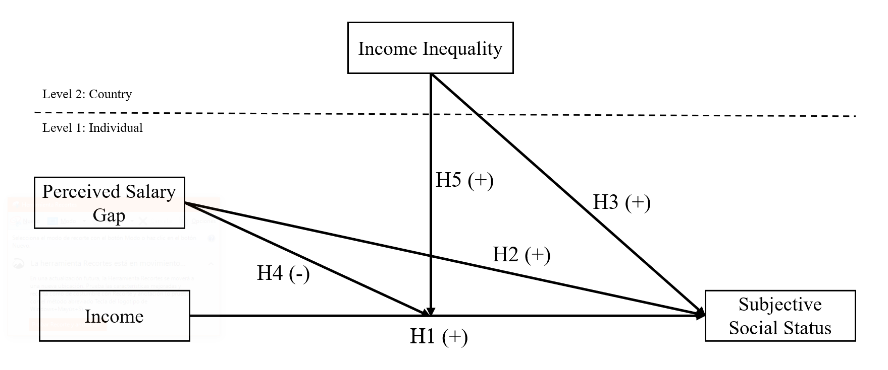
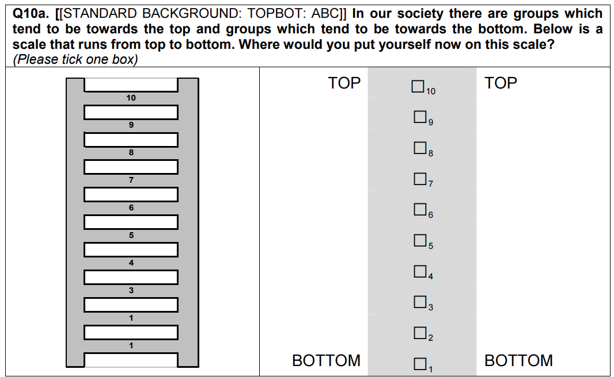
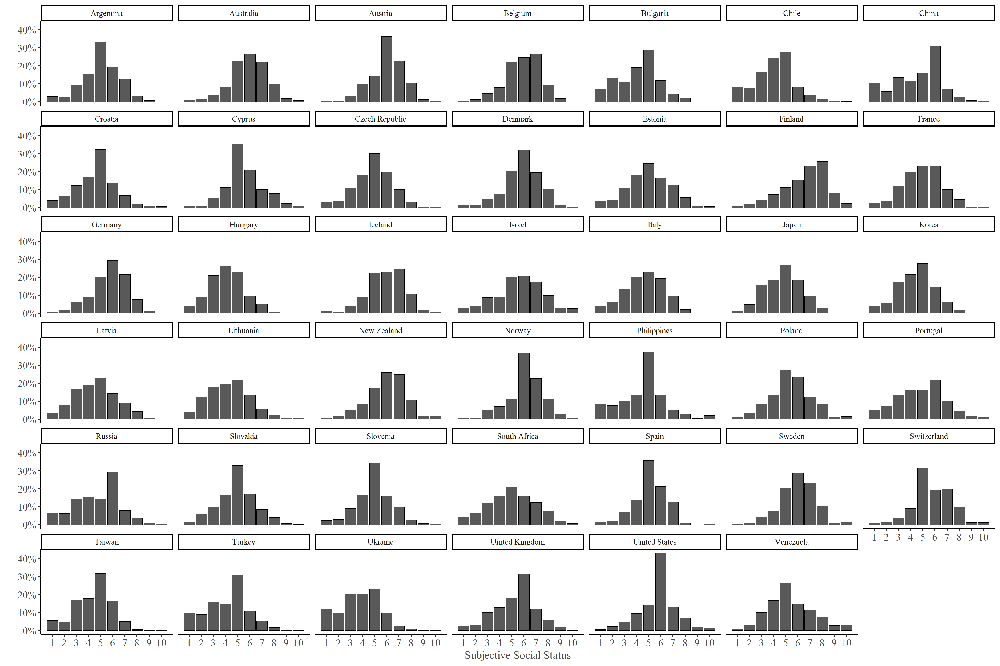
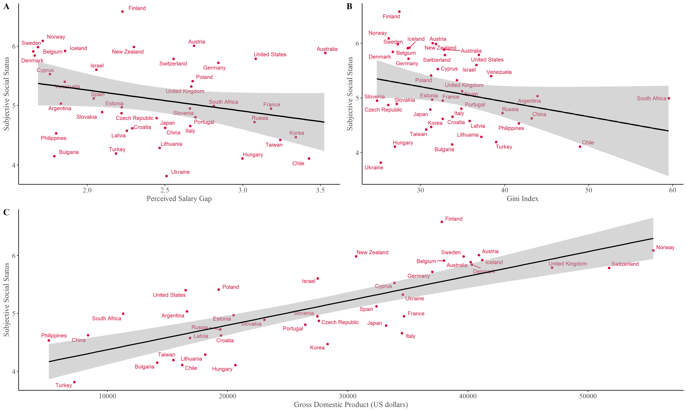
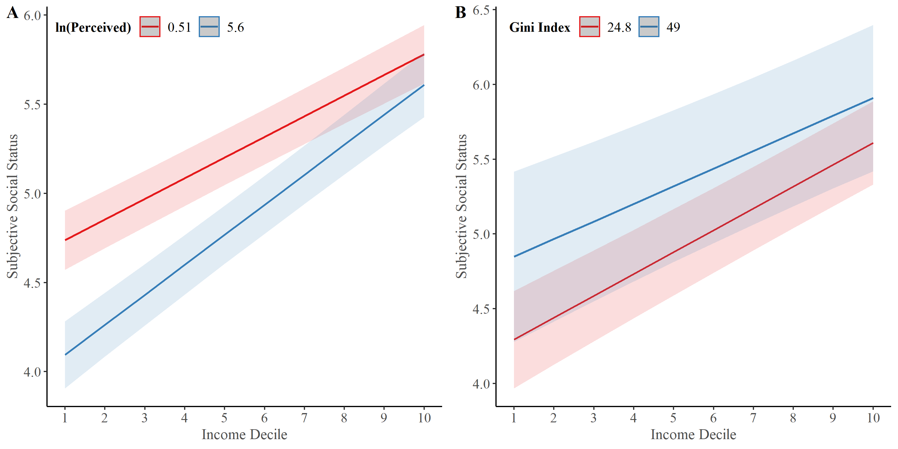

layout: true
class: animated, fadeIn
```{r setup, include=FALSE, cache = FALSE}
library(RefManageR)
bib <- ReadBib("isa-2020.bib", check = TRUE)
```

---
class: inverse, left, middle

# _Objective Position, Subjective Social Status and Perception of Economic Inequality: A Comparative Analysis of 37 Nations._


Julio César Iturra Sanhueza $^1$

***

<br> 

#### February, 2021
##### $^1$ Centro de Estudios de Conflicto y Cohesión Social

---
# Background

* _**Reality Blended Hypothesis**_ `r Cite(bib, c("Evans2004"))`: Subjective Social Status (SSS) Formation as a result of objective position and social comparison processes with reference groups `r Cite(bib, c("festinger1954theory"))`. 

* Social Comparison processes are influenced by changes in social structure `r Cite(bib, c("Lindemann2014","ChenWilliams2018","chen_Discordance_2015"))`. However, the literature shows little evidence regarding how economic inequality affects SSS.

* Changes in social comparison processes affects SSS and this could motivate changes in distributive preferences `r Cite(bib, c("Condon2020"))`.

* Evidence on Perceptions about economic inequality shows that these experiences provide a picture of social comparison processes and biased images of society `r Cite(bib, c("Jasso1990"))`  

---
# Model



---
# Data

1. **Individual data**: International Social Survey Programme 2009 -  Social Inequality IV

.center[]

2. **Country data**: World Data Indicators (World Bank) and The Standardized World Income Inequality Database `r Cite(bib, c("Solt2020"))`  


> **Analytical sample:** 28559 Individuals nested in 39 contries. 

 
---
# Dependent Variable

.center[] 

---

### Individual Level

**Objective Status:** Disposable per capita family Income Deciles


**Perceived Salary Gap**: Indirect subjective inequality measurement

Question: _Please write in how much they ACTUALLY earn each (...)_

* How much do you think a chairman of a large national corporation earns?    
* How much do you think an unskilled worker in a factory earns? 


$$P=\ln\Bigg(\frac{\text{Chairman of corporation}}{\text{ unskilled worker}}\Bigg)$$
### Country level

1. **Country Wealth:** Gross Domestic Product (World Data Indicators)
2. **Objective Inequality:** Gini Index (World Data Indicators)


---
# Method

* Multilevel Regression with random effects `r Cite(bib, c("Hox2008"))`

  * $Y_{SSS} = \gamma_{00}+\gamma_{D10}+\gamma_{\text{ln(perceived)}}+\gamma_{\text{Gini}}+\mu_{0j}+\epsilon_{ij}$

  * $Y_{SSS} = \gamma_{00}+\gamma_{D10}+\gamma_{\text{ln(perceived)}}+\gamma_{D10}\times\gamma_{\text{ln(perceived)}}+\gamma_{\text{Gini}}+\mu_{0j}+\epsilon_{ij}$

  * $Y_{SSS} = \gamma_{00}+\gamma_{D10}+\gamma_{\text{ln(perceived)}}+\gamma_{D10}\times\gamma_{\text{Gini}}+\gamma_{\text{Gini}}+\mu_{0j}+\epsilon_{ij}$


* **Controls:** Gender, Age, Education, Job Status and GDP

---
class: center, middle
# Results
---
class: center, middle



---
class: center, middle

   

---

```{r echo=FALSE, results='asis'}
load(file = "../../output/tables/modelos.RData")
texreg::htmlreg(list(ml07c,ml05gm,ml05rs),
                omit.coef ="(Intercept)|hombre1|edad|educ|labstadesempleado|labstaretirado|labstaestudia|labstatrabajo domestico_cuidados",
                custom.coef.names = c("Income Decile (D10)","Perceived Salary Gap (log)","Gini index","GDP","D10 x Perc Gap","D10 x Gini"),
                single.row = T,
                include.aic = F,
                include.loglik = F,caption = NULL)
```
---

  

---
Conclusions


---
class: middle, center

### `r  fontawesome::fa(name = "github", fill = "black")` <br> [github.com/jciturras](https://github.com/jciturras) 

### [github.com/formacionciudadana](https://github.com/formacionciudadana)


